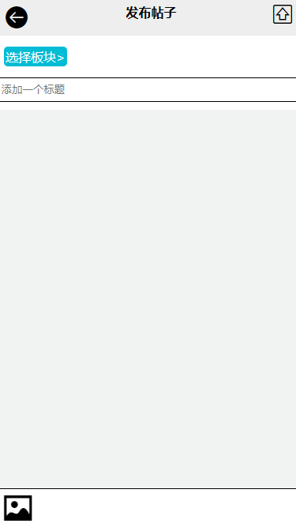
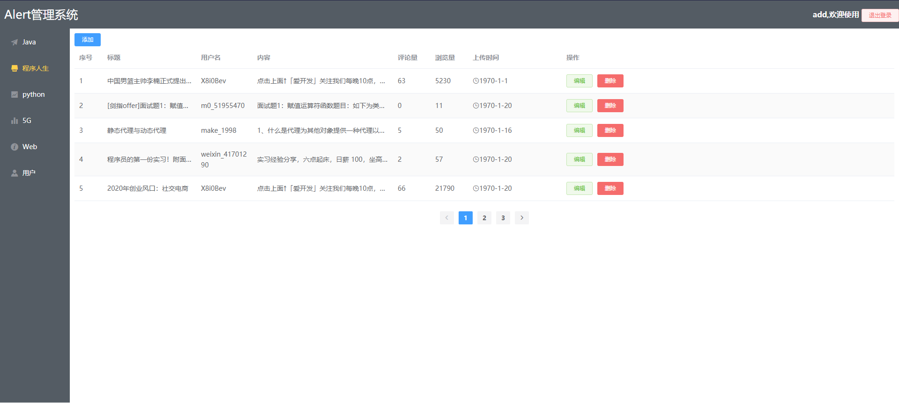
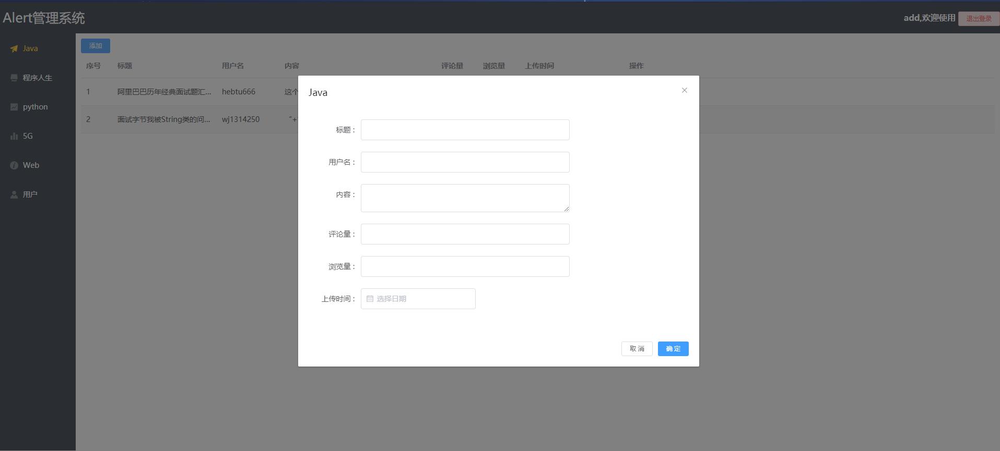

##  项目名称 CSAN

## 演示
    * 官网：https://www.csdn.net/
    * 上线网址：112.74.35.224:8841
    * 后台管理：112.74.35.224:5566
## git 仓库地址 
    https://github.com/gzh52101/csan.git
## 数据库说明
    MongoDB
## 团队分工
    * 负责人：韦明昊，团队成员：陈浩峰，高桂宁
    * 接口负责人：韦明昊
    * 后台管理负责人：陈浩峰
    * app负责人：高桂宁
## 项目页面截图

